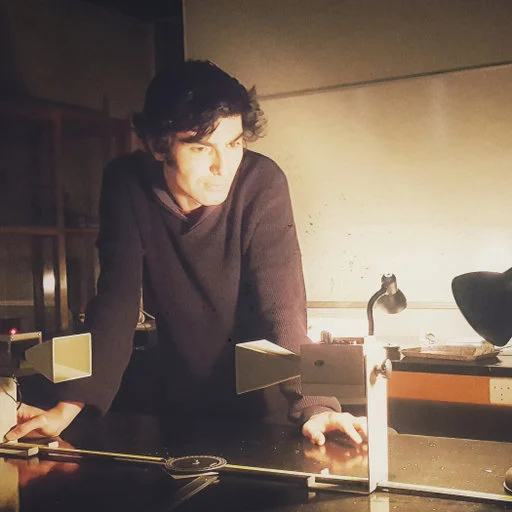

<section id="about">
<h2>About Me</h2>

   
    

        
<strong>Hello!</strong>

        
I am Enfal, a physicist pursuing a PhD in <strong>Particle Physics</strong> at Middle East Technical University (METU), and a software instructor.

        
While exploring the fundamental laws of the universe in my academic career, I solve complex problems in professional life using my skills in <strong>Python, C++, and Data Science</strong>.

        
<strong>Interests:</strong> Particle Physics, Scientific Computing, Aeropropulsion, Data Science

        
<em>"Eppur si muove."</em>

    

</section>

<section id="projects">
<h2>Selected Works</h2>

    

        <h3>🚀 Turbofan Engine Analysis</h3>
        
Comprehensive analysis on Specific Fuel Consumption (SFC) improvement of a CFM56-3B2 engine using MATLAB and GasTurb.

        <a href="#" class="project-link">View Details →</a>
    

    

        <h3>⚡ Plasma RF Simulation</h3>
        
Simulation of Radio-Frequency (RF) plasma developed using computational physics methods with MATLAB and COMSOL Multiphysics.

        <a href="#" class="project-link">View Details →</a>
    

    

        <h3>🌌 Space Radiation</h3>
        
Scientific research project studying space radiation measurement methods using Timepix detectors.

        <a href="#" class="project-link">View Details →</a>
    

</section>

<section id="contact">
<h2>Contact</h2>

    

        
📧

        <h3>Email</h3>
        <a href="mailto:e.sartas@gmail.com">e.sartas@gmail.com</a>
    

    

        
💼

        <h3>LinkedIn</h3>
        <a href="https://linkedin.com/in/enfal-sartas" target="_blank">linkedin.com/in/enfal-sartas</a>
    

    

        
🐙

        <h3>GitHub</h3>
        <a href="https://github.com/esartas" target="_blank">github.com/esartas</a>
    

</section>
